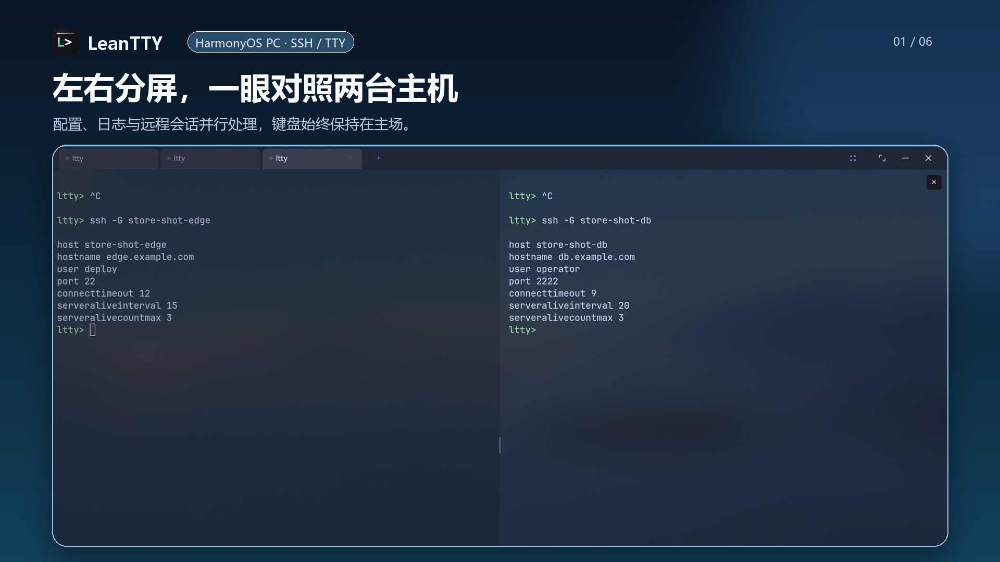

# LeanTTY

[简体中文](README.md) | **English**

**LeanTTY is a keyboard-first SSH / TTY terminal for HarmonyOS. It gives
developers and operations engineers a reliable, efficient way to enter a Linux
subsystem, servers and development environments for professional command-line
and coding-agent work.**



> **Current device scope:** Physical ARM64 HarmonyOS PCs with a keyboard and
> mouse. MatePad and touch-first use are not supported yet.
>
> **Current release status:** On August 29, 2026, the maintainer confirmed that
> 1.5.1 passed AppGallery review and became available. Its source and immutable
> public artifacts are available from the
> [GitHub Release](https://github.com/wandcs/leantty/releases/tag/v1.5.1).

## Why LeanTTY

- **Simple:** One clear SSH / TTY path, without a parallel host-asset platform
  or a feature-count race.
- **Efficient:** Tabs, at most two panes per tab, terminal search, the system
  clipboard and dependable keyboard paths reduce context switching.
- **Secure by design:** No LeanTTY account, advertising, analytics SDK,
  telemetry or LeanTTY cloud service. Host configuration and verified keys are
  kept in protected local storage on the device.
- **Reliable:** Connections, input and output, focus, sizing, clipboard,
  disconnects and recovery are designed to behave predictably, with critical
  interactions validated on physical HarmonyOS PCs.
- **Modern:** Native HarmonyOS window, keyboard, clipboard, language and
  notification integration for current OpenSSH, tmux, editor and coding-agent
  TUI workflows.

## Where it fits

### Use the Linux subsystem on your HarmonyOS PC

On supported PCs, Huawei's official
[Fusion Development Engine (Linux subsystem)](https://consumer.huawei.com/cn/support/content/zh-cn16091898/)
can run a shell, toolchains, tmux, editors and coding agents in openEuler, so an
external server is not required. Today, the user must start `sshd` inside the
subsystem, find its current IP address and configure it as an ordinary SSH Host.
LeanTTY does not install, start, discover or manage the Linux subsystem.

### Connect to servers and remote development environments

If you already have a Linux server, development machine or another SSH
environment, LeanTTY can reuse OpenSSH Host configuration, private keys and a
single ProxyJump hop while keeping different tasks in one keyboard workspace.

### Work with long-running TUIs and coding agents

LeanTTY 1.5 establishes a compatibility baseline for selected stable versions
of Codex CLI, OpenCode, Pi Agent and Qwen Code over both ordinary SSH and tmux.
When a remote program emits a supported terminal-attention signal, LeanTTY can
show a restrained system notification and return to the source pane. It does
not inspect terminal content to guess whether a task has finished.

## Core capabilities

- SSH password authentication and OpenSSH Ed25519, RSA and ECDSA private keys
- `known_hosts` verification, OpenSSH Host configuration and one ProxyJump hop
- OpenSSH configuration and key import/export, connection timeouts,
  ServerAlive and one-shot redacted diagnostics
- Multiple tabs, up to two panes per tab, terminal search, link opening and the
  system clipboard
- Controlled single-file `put` / `get` in the current foreground pane
- Native Chinese and English UI; commands, technical output and remote content
  remain unchanged
- ArkTS / ArkUI application shell, Rust / russh SSH transport and ArkWeb /
  xterm.js terminal rendering

## Get started

1. Search for **LeanTTY** in AppGallery on a HarmonyOS PC and install the
   currently available version.
2. Prepare a reachable execution environment: Fusion Development Engine on
   the PC, or an existing SSH server.
3. Configure an ordinary SSH Host in LeanTTY, verify the host fingerprint on
   first connection, and start working.
4. See the [User Guide](docs/user-guide.md) for first connection, keyboard
   interaction, file transfer, data retention and recovery.

LeanTTY is an entry point to an execution environment. It does not bundle
Linux, a local shell, a coding agent, a model service or an SSH server.

## Trust and product boundaries

LeanTTY processes only the data needed for SSH connections and actions the user
initiates. SSH protocol data is sent to the server selected by the user;
HarmonyOS, the system browser and AppGallery have their own data boundaries.
See the [Privacy Policy](PRIVACY.md) and
[Security Model](docs/security-model.md) for the complete explanation.

LeanTTY is not a GUI SFTP file manager, bastion platform, collaboration or
audit system, or large-scale host inventory. It also does not add current
complexity for phones, portrait layouts, touch-only use or virtual-keyboard-first
workflows. The long-term device scope may include MatePad with a physical
keyboard, but support will be announced only after device-specific adaptation
and validation.

## Documentation

- [User Guide](docs/user-guide.md)
- [Product Principles](docs/project-principles.md)
- [Roadmap](docs/roadmap.md)
- [Privacy Policy](PRIVACY.md)
- [Security Policy](SECURITY.md)
- [Support](SUPPORT.md)

## Development and contributing

Development requires Windows, DevEco Studio with HarmonyOS SDK API 6.1.1 (24),
and Rust 1.96+ with the `aarch64-unknown-linux-ohos` target. Real keyboard,
window, lifecycle and SSH interaction must be validated on a physical ARM64
HarmonyOS PC.

```powershell
# Build
.\tools\build-all.ps1

# Example focused routine checks
.\tools\test-regression.ps1 -Group policy,tooling

# Development loop when physical interaction is relevant
.\tools\dev-pc.ps1
```

Formal releases use a separate complete gate. Before contributing, read the
[Contributing Guide](CONTRIBUTING.md), [Coding Guide](docs/coding-guide.md),
[Quality Strategy](docs/quality-strategy.md) and
[Release Process](docs/release-process.md).

## License

LeanTTY is licensed under [Apache-2.0](LICENSE). Third-party components remain
under their own licenses; see the
[Third-Party Notices](docs/THIRD_PARTY_NOTICES.md).
